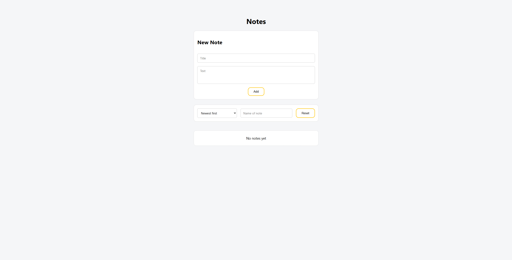
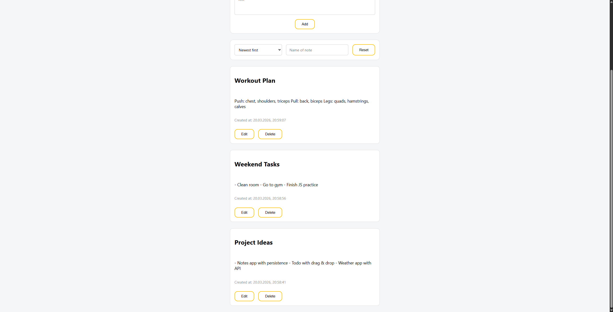
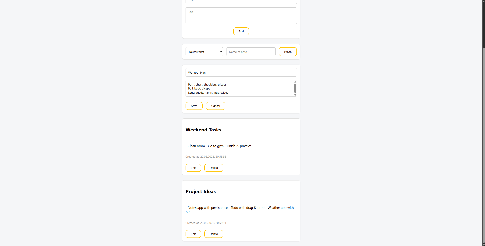
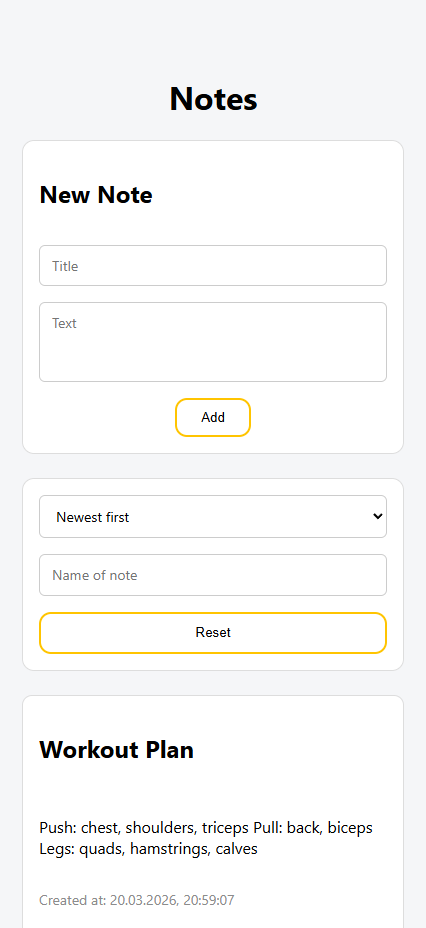
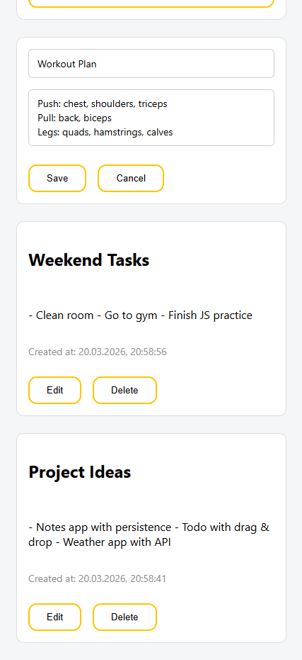

# Notes Pro

Simple note-taking application with persistent storage and state-driven architecture.

## Live Demo

https://netkamaa.github.io/Notes-Pro/

---

# Features

- Create, edit and delete notes
- Search notes by title
- Sort notes by last update
- Persistent storage using localStorage
- Safe data loading with error handling
- Editing state management
- Handling edge cases (invalid actions, missing data)
- Error messages with accessible announcements (aria-live)
- Responsive layout (mobile / tablet / desktop)

---

# Technologies

- HTML5 (semantic markup + accessibility)
- CSS3 (flexbox, responsive design)
- Vanilla JavaScript
- ES Modules
- LocalStorage API

---

# How to run locally

1. Clone repository

git clone https://github.com/netkamaa/Notes-Pro.git

2. Go to project folder

cd Notes-Pro

3. Open index.html in browser

---

# Project Structure

src
├── elements.js
├── handlers.js
├── main.js
├── render.js
├── state.js
└── utils.js

index.html
main.css
README.md

---

# Screenshots

## Empty State

## Notes List

## Edit Mode

## Mobile (Empty State)

## Mobile (Edit Mode)

---

# Architecture

The application follows a **state-driven architecture**:

- `state.js` — application state and business logic
- `render.js` — UI rendering
- `handlers.js` — user interactions
- `utils.js` — filtering and sorting logic
- `elements.js` — DOM references

Flow:

User action → state update → render → DOM update

---

# Notes

- Guard clauses are used to prevent invalid operations
- Editing state is handled consistently
- localStorage is protected with try/catch
- UI remains stable even with corrupted data

---

# Future Improvements

- Drag & drop sorting
- Note categories
- Dark mode
